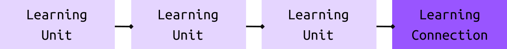

# Learning Connection (LC)

## Introduction

Learning Connections are entities that define how to combine several Learning Units. Each Learning Connection is an actual learning resource, and they have to make use of at least one Learning Unit. There're three types of Learning Connections: **Match**, **Group**, and **Build**.

- [Match (1:1)](#Match)
- [Group (n:n)](#Group)
- [Build (1:n)](#Build)

## Structure

These are the LC fields:

* **id**: The identifier of the Learning Connection
* **type**: Type value, which can be "match", "group", or "build"
* **content** _(optional)_:
* **values**: List of one or more LU id's
* **sorted**: Boolean value that indicates if the order in the "values" list should be taken into account
* **media** _(optional)_: Media elements (audio, image or video), there's more information in the [Adding Media](5-adding-media.md) guide.
* **result**: The id of the result LU in the "group" and "build" LCs
* **author** _(optional)_: Author of this LC

This would be the equivalent structure in JSON format:

```js
{
  id: '',
  type: '',
  content: '',
  values: [],
  sorted: false, // true or false
  media: [],
  author: []
}
```

## Types of LCs

### Match

**`(1:1)`**

This LC stablishes the relationship betwen two LUs or a single LUs with itself (1:1).

**Single Learning Unit - Match Learning Connection:**


**Two Learning Units - Match Learning Connection:**


#### Example 1: Animals example

We want to create an exercise where the student has to identify an animals' description with an image of this animal. We only need this single LU, and a LC that stablishes the relationship:

**Learning Unit**:

We've a LU that describes what's a "Cow". This LU contains:

* the name of the concept (`value` field)
* a description (`content` field)
* an image of a Cow. (`media` field)

```js
{
  id: '1234abcd',
  key: 'cow',
  value: 'Cow',
  content: 'a fully grown female animal of a domesticated breed of ox, kept to produce milk or beef',
  media: ['https://domain.ext/image/cow.png']
}
```

**Learning Connection**:

```js
{
  id: '5678efgh',
  type: 'match',
  content: 'What\'s the name of this animal?',
  values: ['1234abcd'],
  sorted: false,
  media: ['https://domain.ext/audio/animal-question.mp3'],
  author: []
}
```

#### Example 2: Grammar example

We're creating a game to identify pairs of synonyms. We've several LUs, each one describes a word. We need a match LC for each pair of synonyms, indicating these LUs are related. In this case, we're using the pair of synonyms **exact** and **specific**.

**Learning Unit:**

_'exact'_

```js
{
  id: '1234abcd',
  key: 'exact',
  value: 'Exact',
  content: 'accurate or correct in all details'
  media: ['https://domain.ext/audio/exact.mp4']
}
```

**Learning Unit:**

_'specific'_

```js
{
  id: '5678efgh',
  key: 'specific',
  value: 'Specific',
  content: 'clearly defined or identified'
  media: ['https://domain.ext/audio/specific.mp4']
}
```

**Learning Connection:**

This simple Learning Connection only indicates that there ids `1234abcd` and  `5678efgh` are synonyms.

```js
{
  id: '9102ijkl',
  type: 'match',
  content: 'synonyms',
  values: ['1234abcd', '5678efgh'],
  sorted: false, // true or false
  media: [],
  author: []
}
```

### Group

**`(n:n)`**

This LC stablishes the relationship between two or more LUs. A group of LUs consist of several LUs that are classified by an specific criteria (n:n).


#### Example 1: Animals example

Following the same structure, we're going to classify mammals.

**Learning Unit:**

_cow_

> Note: this is the same LU used in the previous example, in order to demonstrate the LUs are reusable and can be used in different exercises.

```js
{
  id: '1234abcd',
  key: 'cow',
  value: 'Cow',
  content: 'a fully grown female animal of a domesticated breed of ox, kept to produce milk or beef',
  media: ['https://domain.ext/image/cow.png']
}
```

**Learning Unit:**

_lion_

```js
{
  id: '5678efgh',
  key: 'lion',
  value: 'Lion',
  content: 'a large tawny-coloured cat that lives in prides, found in Africa and north-western India',
  media: ['https://domain.ext/image/lion.png']
}
```

**Learning Unit:**

_monkey_

```js
{
  id: '9102ijkl',
  key: 'monkey',
  value: 'Monkey',
  content: 'a small to medium-sized primate that typically has a long tail, most kinds of which live in trees in tropical countries',
  media: ['https://domain.ext/image/monkey.png']
}
```

**Learning Unit:**

*mammal (result)*

```js
{
  id: '3456mnop',
  key: 'mammal',
  value: 'Mammal',
  content: 'a warm-blooded vertebrate animal of a class that is distinguished by the possession of hair or fur, females that secrete milk for the nourishment of the young, and (typically) the birth of live young',
  media: []
}
```

**Learning Connection:**

*mammals*

As we can see, the following Learning Connection has an array of values with the three ids of the Learning Units that are part of the *group*, and the **result** values is the id of the LU that describes what a mammal is.

```js
{
  id: '7890qrst',
  type: 'group',
  content: 'mammals',
  values: ['1234abcd', '5678efgh', '9102ijkl'],
  result: '3456mnop',
  sorted: false,
  media: [],
  author: []
}
```

### Build

**`(1:n)`**

This LC stablishes the relationship between two or more LUs. The combination of this LUs is a "Result LU" that is built, in an specific way, using other LUs (1:n).

**Sorted:**



**Unsorted:**


#### Example 1: Water molecule

This **build** example illustrates the use case of having a LU that is required more than once to get a result. We're going to represent the water molecule by combining two molecules of hydrogen and one of oxygen.

Note that the `values` array in the LC object contains the hydrogen molecule LU id **twice**, as we can se in the example below:

**Learning Unit:**

```js
{
  id: '1234abcd',
  key: 'H',
  value: 'Hydrogen',
  content: 1,
  media: []
}
```

**Learning Unit:**

```js
{
  id: '5678efgh',
  key: 'O',
  value: 'Oxygen',
  content: 8,
  media: []
}
```

**Learning Unit (result):**

```js
{
  id: '9102ijkl',
  key: 'H2O',
  value: 'dihydrogen monoxide',
  content: 'Water molecules form hydrogen bonds with each other and are strongly polar. This polarity allows it to dissociate ions in salts and bond to other polar substances such as alcohols and acids, thus dissolving them. Its hydrogen bonding causes its many unique properties, such as having a solid form less dense than its liquid form,[c] a relatively high boiling point of 100 °C for its molar mass, and a high heat capacity',
  media: []
}
```

**Learning Connection:**

```js
{
  id: '7890qrst',
  type: 'build',
  content: 'water molecule',
  values: ['1234abcd', '1234abcd', '5678efgh'],
  result: '9102ijkl',
  sorted: false
}
```

#### Example 2: English sentence

In this case, the order of the LUs is **important**. Therefore, the LC has the value **sorted** set to `true`.

**Learning Unit:**

```js
{
  id: '1234abcd',
  key: 'S',
  value: 'subject',
  content: 'I'
}
```

**Learning Unit:**

```js
{
  id: '5678efgh',
  key: 'V',
  value: 'verb',
  content: 'bought'
}
```

**Learning Unit:**

```js
{
  id: '9102ijkl',
  key: 'O',
  value: 'object',
  content: 'a new computer'
}
```

**Learning Unit (result):**

```js
{
  id: '3456mnop',
  key: 'sentence',
  value: 'sentence',
  content: 'I bought a new computer'
}
```

**Learning Connection:**

```js
{
  id: '7890qrst',
  type: 'build',
  content: 'English sentence',
  values: ['1234abcd', '5678efgh', '9102ijkl'],
  result: '3456mnop',
  sorted: true
}
```
